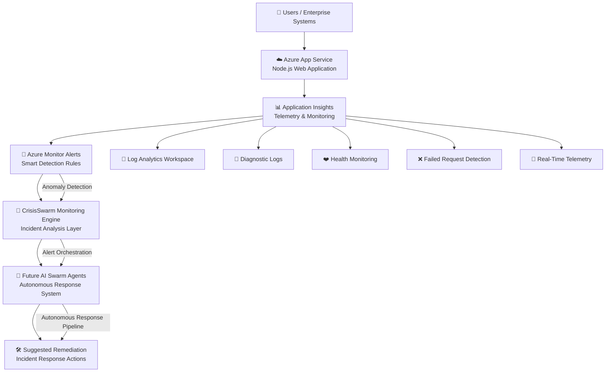

# 🚨 CrisisSwarm

> AI-Powered Autonomous Incident Monitoring & Response System built on Microsoft Azure

CrisisSwarm is a cloud-native intelligent monitoring and incident response prototype designed to detect failures, monitor anomalies, stream telemetry, and simulate autonomous incident handling workflows using Microsoft Azure services.

Built as part of a hackathon project under **Theme 5 — Agent Swarms**.

---

# 📌 Problem Statement

Modern enterprises suffer significant downtime due to:
- delayed incident detection
- slow manual troubleshooting
- fragmented monitoring systems
- lack of intelligent remediation

Traditional monitoring tools only generate alerts after failures occur, forcing engineers to manually investigate logs, analyze failures, and coordinate fixes.

This increases:
- Mean Time To Resolution (MTTR)
- operational costs
- downtime impact
- alert fatigue

---

# 💡 Solution

CrisisSwarm introduces an intelligent monitoring and response pipeline using Azure cloud services.

The platform:
- monitors application health
- streams live telemetry
- detects failed requests
- generates alerts
- simulates autonomous incident response workflows

It serves as the foundation for a future AI-driven multi-agent incident remediation system.

---

# ⚡ Features

## ✅ Cloud-Native Deployment
- Azure App Service deployment
- Node.js backend hosted on Azure

## ✅ Monitoring & Observability
- Azure Application Insights integration
- Real-time telemetry collection
- Live request monitoring
- Health endpoint monitoring

## ✅ Incident Detection
- Failed request detection
- Response time alerting
- Real-time log streaming
- Simulated failure generation

## ✅ Alerting Pipeline
- Azure Monitor alert rules
- Smart detection integration
- Diagnostic logging
- Log Analytics integration

## ✅ Deployment Pipeline
- Kudu ZIP deployment
- GitHub integration
- Cloud-based deployment workflow

---

# 🏗️ Architecture



---

# ☁️ Azure Services Used

| Service | Purpose |
|---|---|
| Azure App Service | Hosting Node.js application |
| Application Insights | Monitoring & telemetry |
| Azure Monitor | Alerting & anomaly detection |
| Log Analytics Workspace | Centralized logging |
| Azure Alerts | Incident notification |
| Kudu Deployment Engine | ZIP deployment pipeline |

---

# 🔥 Demo Workflow

1. User accesses the web application
2. Requests are monitored through Application Insights
3. Azure Monitor tracks telemetry and anomalies
4. Failed requests generate monitoring events
5. Alert rules detect abnormal behavior
6. CrisisSwarm processes incidents for future remediation workflows

---

# 🌐 Endpoints

## Health Endpoint
```bash
/health
```

Returns:
```text
Healthy
```

## Failure Simulation Endpoint
```bash
/error
```

Used to intentionally trigger failures and monitoring alerts.

---

# 📊 Monitoring Capabilities

- Real-time request logging
- Failed request monitoring
- Response time tracking
- Health endpoint monitoring
- Live telemetry streaming
- Diagnostic log collection

---

# 🚀 Future Scope

## AI Incident Response Swarm
Future versions of CrisisSwarm will include:
- autonomous remediation agents
- AI-based root cause analysis
- GPT-powered incident summaries
- multi-agent orchestration
- predictive anomaly detection
- compliance-aware audit logging
- Microsoft Teams integration
- self-healing infrastructure workflows

---

# 🛠️ Tech Stack

- Node.js
- Microsoft Azure
- Azure Monitor
- Application Insights
- Azure App Service
- GitHub
- Kudu Deployment Engine

---

# 📸 Project Screenshots

_Add Azure dashboard, deployment logs, monitoring graphs, and live telemetry screenshots here._

---

# 🎥 Demo Video

_Add demo video link here._

---

# 👨‍💻 Author

**Deepak M**

---

# 🏆 Hackathon Theme

## Primary Theme
**Theme 5 — Agent Swarms**

## Secondary Relevance
- Security
- Productivity
- Autonomous Operations

---

# 📌 Project Status

✅ Live Azure Deployment  
✅ Monitoring & Telemetry  
✅ Alerting Pipeline  
✅ Failure Simulation  
✅ Incident Detection Prototype  
🚧 AI Swarm Expansion In Progress
