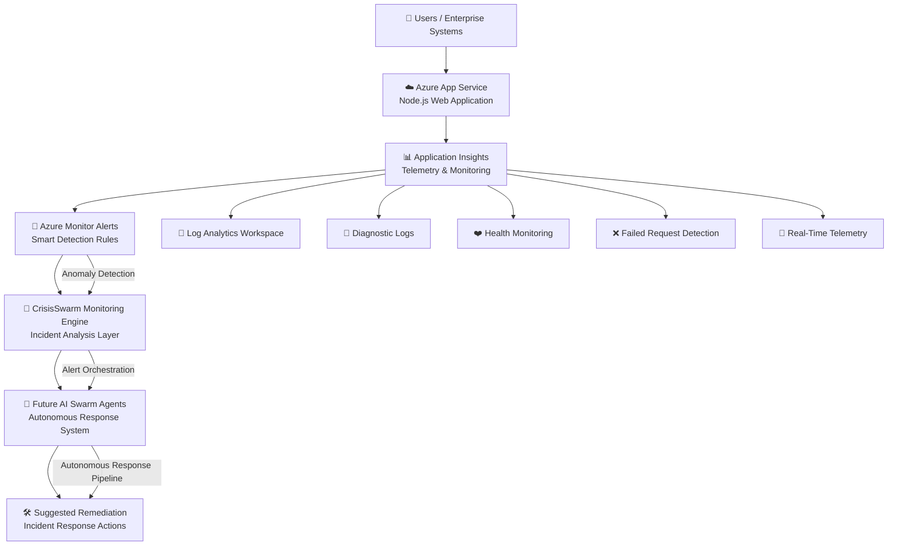

# 🚨 CrisisSwarm — Frontend Control Center

> **Theme 5 — Agent Swarms** (Hackathon Submission)  
> *AI-Powered Autonomous Incident Monitoring & Response System built on Microsoft Azure and Next.js 14.*

**CrisisSwarm** is an enterprise-grade, cloud-native intelligent monitoring and incident response command console. It is designed to detect system outages, stream real-time telemetry, monitor active threats, and orchestrate autonomous incident-remediation workflows through interactive multi-agent swarms.

This repository hosts the **CrisisSwarm Frontend Control Center**—a highly polished, futuristic, and fully responsive Security Operations Center (SOC) dashboard.

---

# 📌 Problem Statement

Modern cloud architectures suffer significant downtime and operational fatigue due to:
1. **Delayed Incident Detection**: Relying on passive alarms that trigger only after a service has completely crashed.
2. **Alert Fatigue**: Flooding DevOps teams with unstructured log alarms and false positives.
3. **Slow Troubleshooting (High MTTR)**: Manually searching databases, analyzing stack traces, and coordinating fixes across distributed nodes.
4. **No Automated Remediation**: Requiring manual engineer intervention for simple, repeating outages (like memory leaks or CPU scale-ups).

---

# 💡 The CrisisSwarm Solution

CrisisSwarm solves this by implementing an active observability pipeline coupled with an autonomous multi-agent swarm:
* **Active Observability**: Streams live latency history, error rates, and CPU/Memory loads via Azure Application Insights and Monitor.
* **Autonomous Remediation**: Employs specialized swarm agents (AutoScaler, MemoryOptimizer, NetworkShield) to instantly run health checks, apply hotfixes, and provision resources autonomously.
* **Command & Control**: Provides developers and security leads with a real-time, unified console to inspect nodes, override commands, and monitor alerts.

---

# 🏗️ System Architecture



---

# ⚡ Dashboard Features

The Next.js 14 frontend implements an interactive, immersive, and fully responsive command center interface:

### 1. 📊 Command Center (Main Dashboard)
* **Integrity Dial**: An animated SVG integrity dial displaying overall system health status, tracking uptime, active outages, and SLA logs.
* **Real-time KPI Metrics**: Tracks System Health, Outage Count, Average Latency, and Request rate with trend indicators.
* **Telemetry Charts**: Interactive Recharts areas and lines tracking CPU loads, memory usage, and response times over 24-hour cycles.
* **Alert Feed**: Color-coded, severity-filtered notification log of recent alerts.

### 2. 🛡️ Swarm Operations (`/agents`)
* **Interactive SVG Topology**: A visual map displaying connected swarm nodes and hubs with pulsing connection beams and animated packet streams. Clicking any node loads its active role and real-time CPU/Memory telemetry.
* **Live Operations Terminal**: A scrolling command console streaming simulated agent operations and repair logs in real-time (updating every 3 seconds) with pause/resume capability.
* **Agent Fleet Grid**: Detailed cards for all active agents (AutoScaler-Alpha, MemoryOptimizer-Beta, etc.) displaying success rates, CPU bounds, memory utilization, and total outages mitigated.
* **Command Executor**: A queue widget tracking active remediation scripts (e.g. `SCALE_UP_ALPHA`, `RESTART_DATABASE`).

### 3. 🚨 Incident Center (`/incidents`)
* **Severity & Status Filters**: Instantly filters open issues by severity (Critical, High, Medium, Low) and state (Active, Investigating, Resolved).
* **Outage Details Drawer**: Clicking an incident slides out a detailed drawer containing timeline logs, affected microservices, and agent comments.

### 4. 📈 Advanced Analytics (`/analytics`)
* **Load Breakdown**: Doughnut charts displaying request loads per service (Auth, Gateway, DB, Cache).
* **Agent Efficiency Heatmap**: Plots response time metrics against success ratios.
* **Topology Heatmap**: Color-coded nodes highlighting heavy-traffic servers.

### 5. ☁️ Live Azure Observability (`/azure`)
* **Live Connection Badge**: Measures latency and reports connection state (`live`, `degraded`, or `offline`) to the live Azure Express.js backend.
* **Failover Alert Simulator**: Exposes a one-click trigger to hit the `/error` endpoint of the backend, verifying that App Insights triggers the Azure Monitor alert pipeline.

### 6. ⚙️ SOC Settings (`/settings`)
* Tuning sliders for CPU/Memory alert thresholds.
* Toggles for notification endpoints (Slack Webhooks, SMS, Email).
* Agent permissions (Auto-scaling, Auto-remediation, Maintenance suppression).

---

# 🛠️ Tech Stack & Styling

* **Core**: Next.js 14 (App Router), React 18, TypeScript (strict mode)
* **Styling**: TailwindCSS with CSS custom property HSL variables
* **Aesthetics**: Glassmorphism cards, upper border sheens, hover cyber grid lines, and cursor-tracking radial spotlight glows (spotlight spotlight highlights are hardware-accelerated).
* **Animations**: Framer Motion
* **Charts**: Recharts
* **Icons**: Lucide React

---

# 🚀 Getting Started

### Prerequisites
* Node.js 18+
* npm or yarn

### Installation
1. Clone the repository:
   ```bash
   git clone https://github.com/Princedeepu381/CrisisSwarm.git
   cd CrisisSwarm
   ```
2. Install dependencies:
   ```bash
   npm install
   ```
3. Set up environment variables:
   Create a `.env.local` file in the root directory:
   ```env
   # Set to your local or deployed backend API URL
   NEXT_PUBLIC_API_URL=https://crisisswarmapp-bhfvchcd6fhgtdd.southeastasia-01.azurewebsites.net
   ```
4. Run the development server:
   ```bash
   npm run dev
   ```
5. Open your browser and navigate to **[http://localhost:3000](http://localhost:3000)**.

### Build for Production
```bash
npm run build
npm start
```

---

# ☁️ Azure Integration Details
CrisisSwarm interfaces with:
* **Azure App Service**: Hosts the core API and telemetry endpoints.
* **Application Insights**: Collects live request logs, exception traces, and dependency health.
* **Azure Monitor**: Triggers alerts when metrics violate configured thresholds.

To test the alert pipeline, visit the **Azure Integration** page on the dashboard and click **Trigger /error Alert** to generate a synthetic backend error.

---

# 👨‍💻 Author
**Deepak M**
