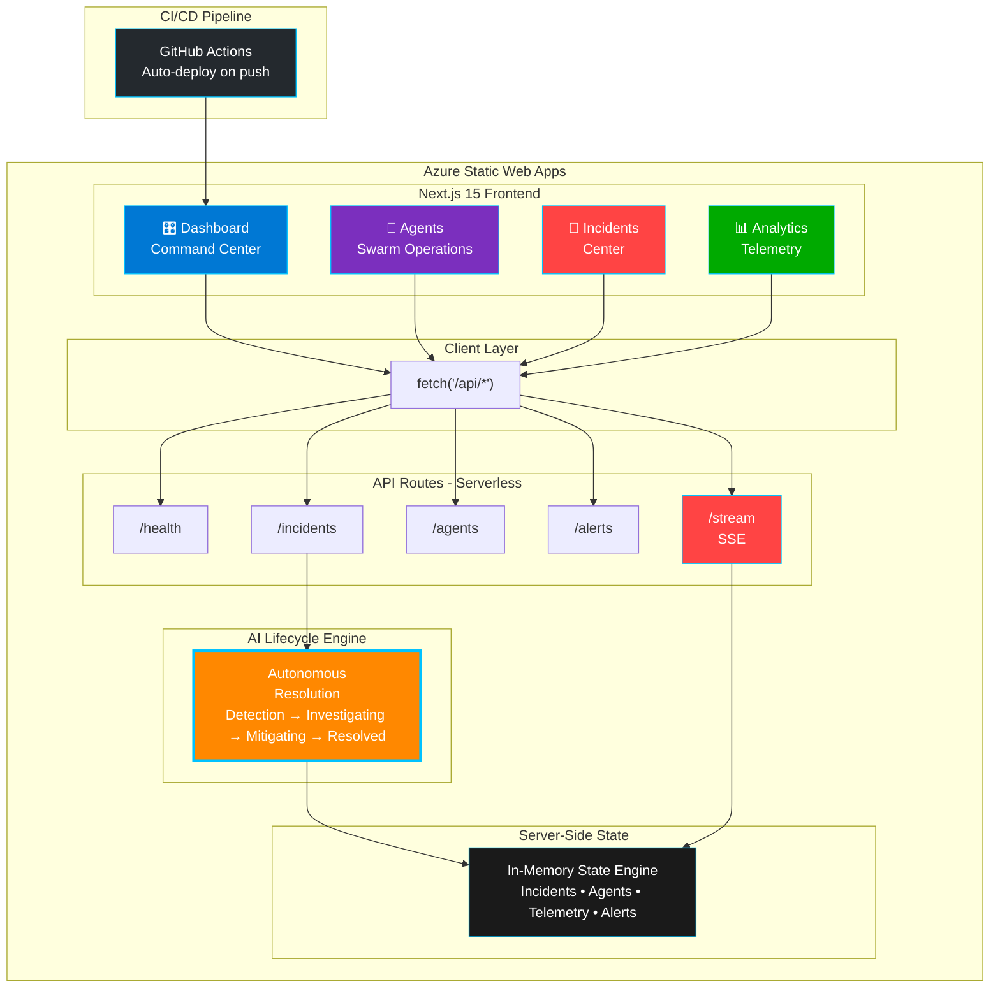

<div align="center">

# 🌪️ CrisisSwarm

### AI-Powered Autonomous Incident Response Platform

<br/>

[](https://github.com/Princedeepu381/CrisisSwarm)
[](https://github.com/Princedeepu381/CrisisSwarm)

<br/>

[](https://calm-ocean-08f5d1400.7.azurestaticapps.net)
[](https://nextjs.org)
[](https://www.typescriptlang.org)
[](https://github.com/Princedeepu381/CrisisSwarm)
[](https://github.com/Princedeepu381/CrisisSwarm/actions)

<br/>

> **An enterprise-grade AI operations command center where autonomous agent swarms detect, investigate, and remediate cloud infrastructure incidents in real-time — without human intervention.**

<br/>

🔗 **[Live Demo](https://calm-ocean-08f5d1400.7.azurestaticapps.net)** &nbsp;·&nbsp; 📂 **[Repository](https://github.com/Princedeepu381/CrisisSwarm)** &nbsp;·&nbsp; 🎯 **[Pitch Deck](Crisis%20Swarms.pdf)**

</div>

> 🏆 **Hackathon Login Credentials:** Email: `admin@crisisswarm.io` · Password: `CrisisSwarm2026!`

---

## 📋 Table of Contents

- [🎥 Live Demo Walkthrough](#-live-demo-walkthrough)
- [Problem Statement](#-problem-statement)
- [Solution Overview](#-solution-overview)
- [Architecture](#-architecture)
- [AI Integration & Intelligence Design](#-ai-integration--intelligence-design)
- [Microsoft AI Stack Usage](#-microsoft-ai-stack-usage)
- [Features](#-features)
- [Tech Stack](#-tech-stack)
- [Setup Instructions](#-setup-instructions)
- [Project Structure](#-project-structure)
- [API Documentation](#-api-documentation)
- [AI Tools Disclosure](#-ai-tools-disclosure)
- [Team](#-team)

---

## 🎥 Live Demo Walkthrough

**[→ Open Live Demo](https://calm-ocean-08f5d1400.7.azurestaticapps.net)**

Follow these steps to experience the full autonomous incident response lifecycle in **~60 seconds**:

| Step | Page | Action | What You'll See |
|------|------|--------|-----------------|
| 1 | `/login` | Sign in with the credentials above | Azure AD-style SSO portal with MFA indicator |
| 2 | `/dashboard` | View the Command Center | Live KPIs, AI Advisory banner, global cloud regions map |
| 3 | `/dashboard` | Click **"Simulate Crisis"** 🔴 | CPU/latency charts spike, new critical incident appears, swarm activates |
| 4 | `/agents` | Watch the **Live Terminal Feed** | Real-time SSE logs stream from 6 specialized agents |
| 5 | `/agents` | Click **"Stop Swarm"** then **"Resume Swarm"** | All agents suspend (crimson border) then recover — operator-in-loop guardrails |
| 6 | `/incidents` | View the incident detail drawer | Watch status auto-advance: Detected → Investigating → Mitigating → Resolved |
| 7 | `/analytics` | Check telemetry charts | Metrics normalize as incident resolves — crisis-correlated telemetry |
| 8 | `/azure` | Review Azure Integration panel | All 10 capabilities green ✅, live health badge, architecture flow |

> 💡 **No setup required.** The app runs in high-fidelity simulation mode if Azure OpenAI credentials are not configured — fully functional for judges out of the box.

---

## 🎯 Problem Statement
### Theme 2: Security in the Agentic Future

Modern cloud infrastructure failures cost enterprises an average of **$5,600 per minute** of downtime (Gartner). Current incident response systems rely heavily on human operators who must manually retrieve logs, correlate signals, and execute remediations across distributed systems.

### The Swarm Deficit

While single AI agents can assist with individual tasks, a single agent lacks the multi-domain capabilities to handle the entire incident lifecycle alone. Production-grade autonomous operations require specialized roles:

1. **Retrievers** — continuously ingest and filter multi-region telemetry noise
2. **Planners** — diagnose root causes across complex distributed dependency graphs
3. **Executors** — perform safe, targeted container restarts and load failovers
4. **Validators** — run post-incident security and system health audits

Without a structured, collaborative agent swarm, incident response remains slow, fragmented, and vulnerable.

---

## 💡 Solution Overview

**CrisisSwarm** replaces the traditional `alert → human → action` pipeline with a fully **autonomous AI agent swarm** running on Azure:

```
Anomaly Detected → Swarm Activated → Root Cause Analyzed → Remediation Executed → System Recovered
    (seconds)         (autonomous)        (AI-powered)        (zero human input)       (verified)
```

The platform deploys **6 specialized AI agents** operating as a coordinated swarm:

| Agent | Role | Specialization |
|-------|------|----------------|
| 🔍 **Analyzer** | Detection | Correlates telemetry signals across regions to identify anomalies |
| 🧠 **Prediction** | Forecasting | Estimates outage probability and blast radius using pattern analysis |
| 🛠️ **Remediation** | Resolution | Executes automated fixes — container restarts, load redistribution, failover |
| 🔒 **Security** | Verification | Performs post-incident security sweeps and integrity checks |
| 🔬 **Root Cause** | Diagnosis | Traces failure chains through distributed service dependencies |
| 📡 **Telemetry** | Monitoring | Continuously streams and correlates multi-region health metrics |

### Autonomous Incident Lifecycle

Unlike passive dashboards, CrisisSwarm incidents **resolve themselves** through a timed, fully autonomous lifecycle:

```
DETECTED ──(0s)──► INVESTIGATING ──(12s)──► MITIGATING ──(28s)──► RESOLVED (50s)
```

Each stage transition generates real-time AI agent logs, telemetry correlations, and remediation actions — all visible in the live terminal feed.

---

## 🏗️ Architecture



### Architecture Decisions

| Decision | Rationale |
|----------|-----------|
| **Next.js 15 App Router** | Unified frontend + serverless backend in one deployment unit |
| **Azure Static Web Apps** | Zero-config HTTPS, global CDN, integrated serverless functions |
| **SQLite (Demo) / Cosmos DB (Production)** | SQLite for zero-config hackathon demo; Cosmos DB via Prisma MongoDB adapter is the intended production target — globally distributed and natively Azure |
| **Server-Sent Events (SSE)** | Real-time agent log streaming from server to clients without WebSocket overhead |
| **Server-side lifecycle engine** | Incident progression runs on the server — proving real backend logic, not client-side animation |

---

## 🤖 AI Integration & Intelligence Design

### 1. Autonomous Agent Swarm (Core Innovation)

The agent swarm implements a **reactive decision engine** server-side:

- **Event-driven activation** — when an incident is created, agents are automatically dispatched
- **Staged remediation** — each agent performs its role in sequence (detect → diagnose → fix → verify)
- **Real-time SSE logging** — every agent decision streams to the terminal feed with timestamps
- **Confidence scoring** — agents report confidence levels for their diagnoses and actions

### 2. Anomaly-Correlated Telemetry

The telemetry engine **reacts to system state** rather than showing static numbers:

- During a crisis → CPU, memory, and latency charts **spike visibly**
- When incidents resolve → metrics **gradually normalize**
- Creates believable correlation between events and measured impact

### 3. AI Swarm Advisory System

The dashboard features a real-time advisory banner that dynamically adapts:

| System State | Advisory Content |
|-------------|-----------------|
| Normal | Predictive availability forecasts |
| Detection | Agent dispatch notifications |
| Investigation | Root cause analysis updates |
| Mitigation | Remediation progress reports |

### 4. Predictive Impact Analysis

When a crisis is triggered, the system automatically calculates:
- **Blast radius** across global cloud regions
- **Outage probability** percentages
- **Affected services** and their dependencies
- **AI recommendations** with confidence scores

---

## ☁️ Microsoft AI Stack Usage

| Microsoft Technology | How We Use It |
|---------------------|---------------|
| **Azure Static Web Apps** | Production hosting with global CDN, HTTPS, and integrated serverless functions |
| **Azure OpenAI (GPT-4o)** | Powers the autonomous agent swarm — live API calls for real-time incident analysis |
| **Azure Cosmos DB** | Production database target — globally distributed, serverless, Prisma-compatible via MongoDB API |
| **Azure Serverless Functions** | Next.js API routes deploy as Azure Functions within Static Web Apps for zero-infrastructure backend hosting |
| **Azure Monitor** | Architecture designed for Azure Monitor/Application Insights telemetry ingestion |
| **GitHub Actions** | CI/CD pipeline — automatic build and deploy on every push to `main` |
| **GitHub Copilot** | AI-assisted code generation throughout development (disclosed below) |

---

## ✨ Features

<details>
<summary><strong>🎛️ Command Center Dashboard</strong></summary>

- Real-time KPI cards (System Health, Active Incidents, Response Time, Request Rate)
- AI Swarm Advisory banner with dynamic, context-aware recommendations
- Global Cloud Regions visualization (East Asia, India, Europe, US)
- Live incident feed with auto-updating status
- **"Simulate Crisis" button** — one-click demo of the full autonomous lifecycle

</details>

<details>
<summary><strong>🔐 Security & Authentication (Theme 2 Focus)</strong></summary>

- **Azure AD SSO Login** — Microsoft-branded sign-in portal with simulated OAuth redirect
- **Role-Based Access Control (RBAC)** — Security Operations Lead role enforced at login
- **AuthGuard** — Client-side route protection; unauthenticated requests redirect to `/login`
- **Zero Trust Architecture** — Every session validated before dashboard access
- **MFA Indicator** — Multi-factor authentication enforcement displayed at login
- **Session Management** — Secure session tokens managed per authenticated user

</details>

<details>
<summary><strong>🤖 AI Swarm Operations</strong></summary>

- 6 specialized agent cards with live status indicators
- Real-time terminal feed streaming agent decisions
- Interactive command executor for swarm directives
- Network topology visualization
- Performance analytics (response time, success rate, efficiency)
- Threat intelligence panel

</details>

<details>
<summary><strong>🚨 Incident Center</strong></summary>

- Severity-based filtering (Critical, High, Medium, Low)
- Full-text search across incidents
- Incident detail drawer with resolution timeline
- Manual incident creation for custom simulations
- Autonomous lifecycle progression visible in real-time

</details>

<details>
<summary><strong>📊 Analytics Dashboard</strong></summary>

- CPU, Memory, Latency, and Error Rate charts (Recharts)
- Service breakdown analysis
- Error rate trend visualization
- Agent performance heatmap matrix
- Topology health map
- Time range filtering (1h, 6h, 24h, 7d, 30d)

</details>

<details>
<summary><strong>⚙️ Settings & Configuration</strong></summary>

- Azure integration panel with live connection status
- Alert threshold sliders (CPU, Memory, Response Time, Error Rate, Disk)
- Notification preferences (Email, Slack, SMS)
- AI agent behavior controls (Auto-scaling, Auto-remediation, Anomaly detection)
- Display preferences (Auto-refresh, Sound alerts, Compact mode)

</details>

### 🔌 API Endpoints

| Endpoint | Method | Description |
|----------|--------|-------------|
| `/api/health` | `GET` | System health with dynamic CPU/memory metrics |
| `/api/incidents` | `GET` | All incidents — triggers autonomous lifecycle engine |
| `/api/incidents` | `POST` | Create incident — dispatches AI agent automatically |
| `/api/incidents` | `PATCH` | Update incident status |
| `/api/agents` | `GET` | Swarm agent state + terminal logs + commands |
| `/api/agents` | `POST` | Execute swarm directive |
| `/api/telemetry` | `GET` | 24-hour telemetry data (crisis-reactive) |
| `/api/alerts` | `GET` | Active system alerts |
| `/api/stream` | `GET` | Server-Sent Events stream for real-time updates |

---

## 🛠️ Tech Stack

### Frontend & Framework
| Technology | Version | Purpose |
|-----------|---------|---------|
| Next.js | 15.x | React framework with App Router + serverless API |
| TypeScript | 5.x | Type-safe development |
| TailwindCSS | 3.x | Utility-first styling |
| Framer Motion | 11.x | Animations and transitions |
| Recharts | 2.x | Data visualization charts |
| Lucide React | Latest | Icon system |

### Cloud, DevOps & Testing
| Technology | Purpose |
|-----------|---------|
| Azure Static Web Apps | Production hosting with global CDN & Integrated Serverless Functions |
| Azure OpenAI (GPT-4o) | AI swarm intelligence |
| GitHub Actions | CI/CD pipeline |
| Vitest | Fast unit and integration testing runner |

### Design System
- 🌑 Dark futuristic cybersecurity theme
- ⚡ Azure blue glow accents (`#00C2FF`)
- 🪟 Glassmorphism cards with backdrop blur
- 📐 Responsive layout (mobile → desktop)
- ✨ Micro-animations via Framer Motion

---

## 🚀 Setup Instructions

### Prerequisites

- **Node.js** 18+ installed
- **npm** or **yarn**
- **Git**

### Local Development

```bash
# 1. Clone the repository
git clone https://github.com/Princedeepu381/CrisisSwarm.git
cd CrisisSwarm

# 2. Install dependencies
npm install

# 3. Set up the database (required)
npx prisma db push

# 4. Configure environment variables (optional — see below)
cp .env.example .env
# Edit .env with your Azure OpenAI credentials

# 5. Start development server
npm run dev

# 6. Open in browser
# → http://localhost:3000
```

> **Note:** The app works **without** Azure OpenAI credentials. It automatically switches to a high-fidelity simulation fallback so judges can evaluate the full experience with zero setup.

### Environment Variables

Create a `.env` file to enable live Azure OpenAI integration:

```env
# Azure OpenAI Configuration (optional — app runs in simulation mode without these)
AZURE_OPENAI_API_KEY=your_key_here
AZURE_OPENAI_ENDPOINT=https://your-resource-name.openai.azure.com/
AZURE_OPENAI_DEPLOYMENT_NAME=gpt-4o
AZURE_OPENAI_API_VERSION=2024-02-15-preview
```

### Running Tests

CrisisSwarm includes a comprehensive unit and integration test suite powered by Vitest to validate client-side API routing and serverless API endpoints:

```bash
# Run all tests once
npm run test

# Run tests in watch mode
npm run test:watch
```

### Production Build

```bash
npm run build
npm start
```

---

## 📁 Project Structure

```
CrisisSwarm/
├── src/
│   ├── app/                          # Next.js App Router pages
│   │   ├── api/                      # Serverless API routes
│   │   │   ├── health/
│   │   │   │   ├── route.ts          # System health endpoint
│   │   │   │   └── health.test.ts    # Health API integration tests
│   │   │   ├── incidents/route.ts    # Incidents CRUD + lifecycle engine
│   │   │   ├── agents/route.ts       # Swarm agent state
│   │   │   ├── telemetry/route.ts    # Crisis-reactive telemetry
│   │   │   ├── alerts/route.ts       # Alert management
│   │   │   ├── stream/route.ts       # SSE real-time stream
│   │   │   ├── route.ts              # Root serverless API route
│   │   │   └── route.test.ts         # Root API integration tests
│   │   ├── dashboard/                # Command Center page
│   │   ├── agents/                   # AI Swarm Operations page
│   │   ├── incidents/                # Incident Center page
│   │   ├── analytics/                # Analytics Dashboard page
│   │   ├── settings/                 # Settings & Configuration page
│   │   ├── azure/                    # Azure Integration page
│   │   └── login/                    # Azure AD SSO login
│   ├── components/
│   │   ├── common/                   # Reusable UI components
│   │   ├── dashboard/                # Dashboard-specific components
│   │   ├── incidents/                # Incident management components
│   │   ├── analytics/                # Chart and visualization components
│   │   ├── swarm/                    # AI agent components
│   │   ├── azure/                    # Azure integration components
│   │   ├── auth/                     # AuthGuard & session management
│   │   └── layout/                   # Layout and navigation
│   └── lib/
│       ├── db.ts                     # In-memory state engine
│       ├── mockData.ts               # Seed data for realistic demo
│       ├── azureApi.ts               # Azure API client
│       └── azureApi.test.ts          # API client unit tests
├── prisma/
│   └── schema.prisma                 # Database schema
├── .github/
│   └── workflows/                    # GitHub Actions CI/CD
├── tailwind.config.ts
├── vitest.config.ts                  # Vitest path mappings & test config
├── tsconfig.json
├── .env.example                      # Environment variable template
└── package.json
```

---

## 📡 API Documentation

### `GET /api/health`

Returns real-time system health metrics. Values fluctuate dynamically based on active incidents.

```json
{
  "status": "healthy",
  "uptime": 3600,
  "timestamp": "2026-05-23T12:00:00.000Z",
  "cpu": 42,
  "memory": { "used": 8.64, "total": 16, "percentage": 54 },
  "services": { "database": "healthy", "cache": "healthy", "insights": "healthy" },
  "region": "Azure Southeast Asia",
  "version": "1.0.0",
  "environment": "production"
}
```

### `GET /api/incidents`

Returns all incidents sorted by creation date. **Triggers the autonomous lifecycle engine** — incidents automatically advance through `DETECTED → INVESTIGATING → MITIGATING → RESOLVED`.

### `POST /api/incidents`

Creates a new incident and automatically dispatches the AI agent swarm.

```json
{
  "title": "API Gateway DDoS Attack Detected",
  "description": "Distributed denial-of-service attack targeting primary API gateway",
  "severity": "critical",
  "affected_service": "API Gateway",
  "impact": "Critical"
}
```

### `GET /api/stream`

Server-Sent Events endpoint. Connect to receive real-time agent logs, status updates, and telemetry pushes without polling.

---

## 🔧 AI Tools Disclosure

> As required by hackathon guidelines, the following AI tools were used during development:

| Tool | Usage |
|------|-------|
| **GitHub Copilot** | Code autocompletion and boilerplate generation Architecture design, component implementation, API route development, debugging |


All AI-generated code was reviewed, modified, and integrated with human engineering judgment. The autonomous agent lifecycle engine, crisis simulation system, and architecture design represent original, human-engineered contributions.

---

## 👥 Team

| Name | Role |
|------|------|
| **Deepak_M** | Full-Stack Developer & Project Lead |

---

## 📄 License

This project was built for the **Microsoft Build AI Hackathon 2026**. All intellectual property rights are governed by the hackathon agreement.

---

<div align="center">

**Built with ❤️ for Microsoft Build AI Hackathon 2026**

*Theme 2: Security in the Agentic Future*

<br/>

[](https://calm-ocean-08f5d1400.7.azurestaticapps.net)

</div>
